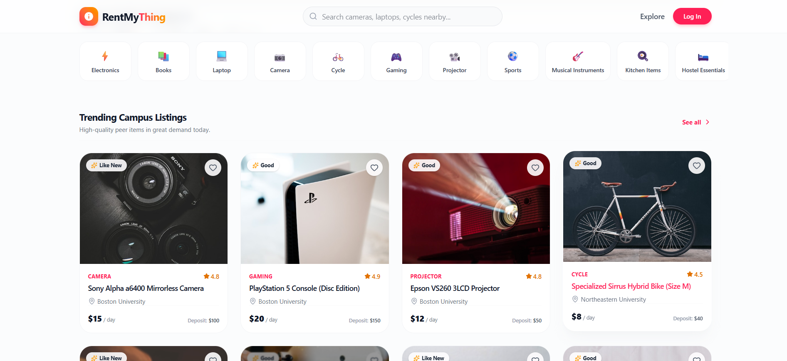
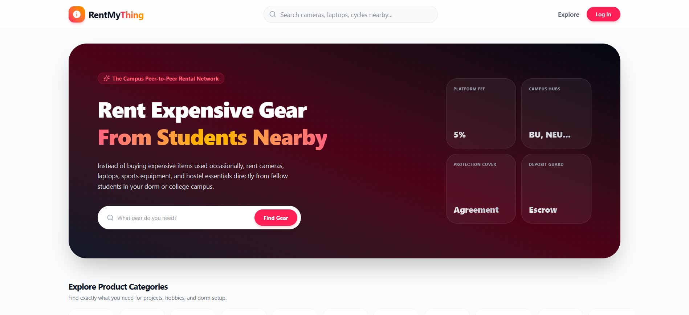

# 🚀 RentMyThing

### Campus Peer-to-Peer Rental Marketplace

Rent expensive gear from students nearby.

[🌐 Live Demo](https://rentmything.ai.studio)

---

# 📸 Project Preview

## 🏠 Homepage

  

---

## 🛍️ Marketplace

  

---

# 💡 About

RentMyThing is a campus-first peer-to-peer rental marketplace that allows students to rent and lend products within their college community.

Instead of purchasing expensive products that are used only occasionally, students can rent them from nearby verified students while owners earn passive income from idle assets.

Think of it as:

> **Airbnb + OLX for College Campuses**

---

# ✨ Features

- 🔍 Smart Search
- 📂 Category Browsing
- ⭐ Ratings & Reviews
- ❤️ Wishlist
- 💰 Daily Rental Pricing
- 🔒 Security Deposit
- 📅 Rental Booking
- 👤 Owner Dashboard
- 🎓 Student Verification
- 📱 Fully Responsive Design

---

# 🛠 Tech Stack

### Frontend

- Next.js
- React
- TypeScript
- Tailwind CSS

### Backend

- Node.js
- Express.js

### Database

- PostgreSQL
- Prisma ORM

### Authentication

- JWT Authentication

### Deployment

- Vercel

---

# 💼 Business Model

- 5% Platform Commission
- Premium Listings
- Campus Partnerships
- Subscription Plans
- Rental Protection
- Featured Products

---

# 🚀 Future Roadmap

- 📱 Mobile App
- 📍 QR Pickup
- 📄 Digital Rental Agreement
- 💳 Escrow Payments
- 🛡️ Fraud Detection
- 🏫 College Partnerships
- 🎁 Rewards & Referral Program

---

# 👨‍💻 Team BLACKTECH

- Abhishek Kumar Tiwari
- Prateek Vijay
- Bhavesh Vijay Verma

---

# 🏆 Hackathon

**ThinkForBharat 1.0 – National Open Innovation Ideathon**

---

# 🌐 Live Website

https://rentmything.ai.studio

---

### ⭐ If you like this project, don't forget to star the repository!

Author - Abhishek kumar tiwari

